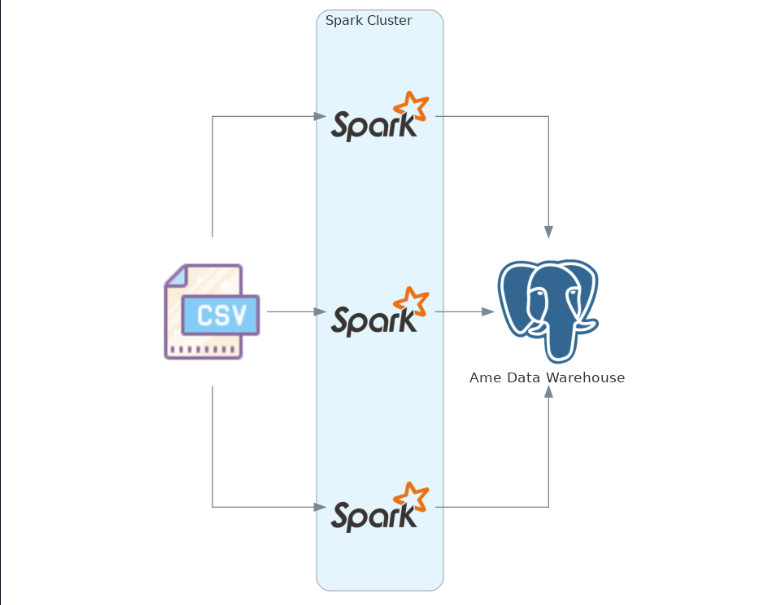

# Ingestão de dados

    

### Banco de dados usado: [Postgresql](https://www.postgresql.org/)

### Arquitetura usada: [Medallion Architecture](https://www.databricks.com/glossary/medallion-architecture)

### Número de clusters: 1

## Executando a Ingestão de dados:

1º - Inicie o container com postgresql

`Make run-docker`

2º - Crie as tabelas

`Make db-create`

3º - Execute todo [notebook](../ame_data_engineer_challenge/data_ingestion.ipynb)

## Processo de ETL

### 🥉 Bronze Layer

1º - Extração dos dados fornecidos em [Kaggle dataset](https://www.kaggle.com/datasets/stackoverflow/stack-overflow-2018-developer-survey?select=survey_results_public.csv), optei por usar os dados provenientes do kaggle ao invés do disponibilizado no desafio.

2º - Tomei a liberdade de selecionar só as colunas usadas para evitar problemas de performance.  

### 🥈 Silver Layer

1º - Conversão de dados "NA" str para None.

2º - Criação dos dataframes operating_system, country, company.

3º - Seleção do dataframe respondent.

4º - Adicionado a coluna id tanto em respondent quando nos dados gerais, pois precisaria referencia-los usando o id. Tomei a liberdade de usar como geração do id o mesmo que vinha do csv com a coluna Respodent.

5º - Transformado nome do respondente assim como descrito no desafio.

6º - Criado as colunas em respondent(operation_system_id, country_id, company_id) que referenciam os id nos dataframes de mesmo nome.

7º - Transformado todos os salários nulos em 0.0.

8º - Feita a conversão de dólar para real(3.81).

9º - Criado os dataframes programming_language e communication_tools.

10º - Criado os dataframes resp_programming_language que referencia tanto programming_language quanto respodent e resp_tools que referencia communication_tools e respodent.

